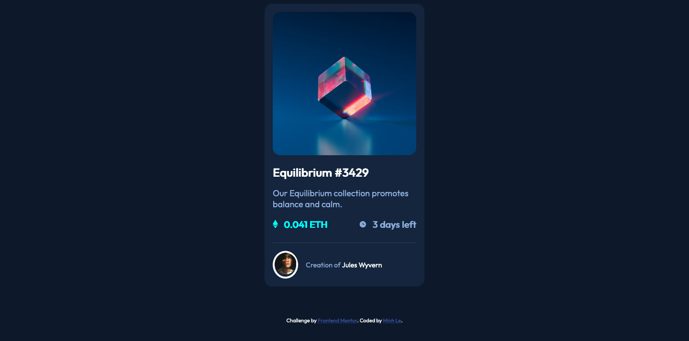

# Frontend Mentor - NFT preview card component solution

This is a solution to the [NFT preview card component challenge on Frontend Mentor](https://www.frontendmentor.io/challenges/nft-preview-card-component-SbdUL_w0U). Frontend Mentor challenges help you improve your coding skills by building realistic projects. 

## Table of contents

- [Overview](#)
  - [Screenshot](#)
  - [Links](#)
  - [Built with](#)
- [Author](#)

## Overview
In this project, I rely mainly on Flexbox layout to provide responsive design for the web. All values
and units are relatively calculated with respect to the default font-size.

###Screenshot

### Links

- Solution URL: [Add solution URL here](https://your-solution-url.com)

### Built with

- Semantic HTML5 markup
- CSS custom properties
- Flexbox
- Relative positioning/sizing

## Author
- Github - [@minhle02](https://github.com/minhle02)

